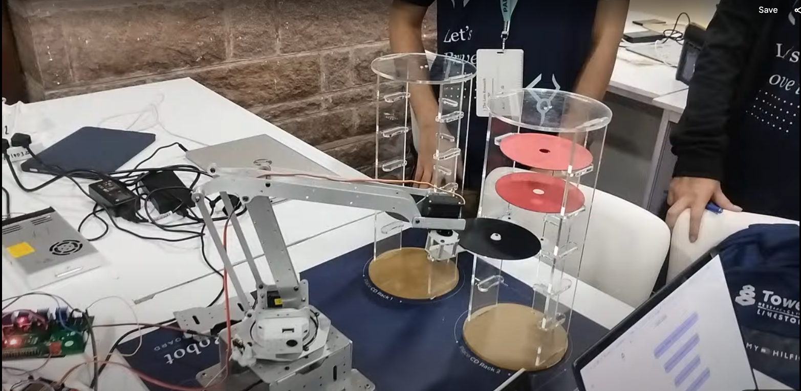

# Autonomous serial manipulator - Robotics Summer project 2025-26

  
  
  
   
  

    
  

 

## 🚀 Overview
This repository is intended to manage the codebase for the **Robotics Arm summer project 2025-26** (part of robotics club). It serves as a comprehensive collection of resources including code, CAD models, calculations, and component datasheets. Our aim is to create a well-documented reference that will enable future teams to build upon our work.

## 🎯 Project Goals
(In continuation with the alredy existing hardware)
- replace all motors with [SC15](https://www.waveshare.com/wiki/SC15_Servo)
- use the waveshare SC15 servo drive with esp32 more info [here](https://www.waveshare.com/wiki/Servo_Driver_with_ESP32#SC_Servo)
- add a battery powersource (6-12v)
- Redesign the Gripper (will be good if you can upload the final CAD models here as well)
- design the SC15 motor mounts
- Coding part
  - solve the inverse kinematic, (or have atleast a rough estimate via trial and error)
  - make the controlls in cylindrical coordinates `[r, h, φ]`.
  - design a UI(web) to controll to wirelessly, (as seen in driver demo)

## 📋 Progress 
Need to break each tasks for ease and also distrubute the task day wise.
For now this is just an overview.
### 🔧 Hardware Upgrades
- [ ] Design motor mounts for SC15 servos
- [ ] Redesign and upload CAD files for the new gripper
- [ ] Replace all motors with SC15 servos
- [ ] Integrate SC15 servo driver with ESP32 
- [ ] Add 6–12V battery power source

### 🧠 Software Tasks
- [ ] Implement inverse kinematics (approximate solution acceptable)
- [ ] Develop cylindrical coordinate-based controls `[r, h, φ]`
- [ ] Build a basic web UI for wireless control (refer to Waveshare demo)

## Timeline 
### Week 1: Planning & Design
!todo()

### Week 2: Initial Implementation
!todo()

### Week 3: Core Functionality
!todo()

### Week 4: Integration & Testing
!todo()

### Week 5: Refinement
!todo()

## 📚 Resources

- [SC15 Servo Documentation](https://www.waveshare.com/wiki/SC15_Servo)
- [ESP32 Servo Driver Guide](https://www.waveshare.com/wiki/Servo_Driver_with_ESP32#SC_Servo)
- [old code base](./code/old_code/)

## 🤝 Contributor Notes
- will be following standard git workflow [here](https://www.geeksforgeeks.org/git-workflows-with-open-source-collaboration/)
- Feel free to suggest improvements via Issues or Discussions
- If you find yourself stuck just raise an issue.

